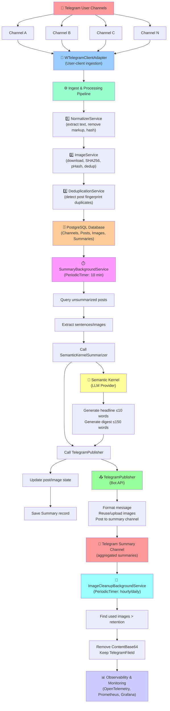
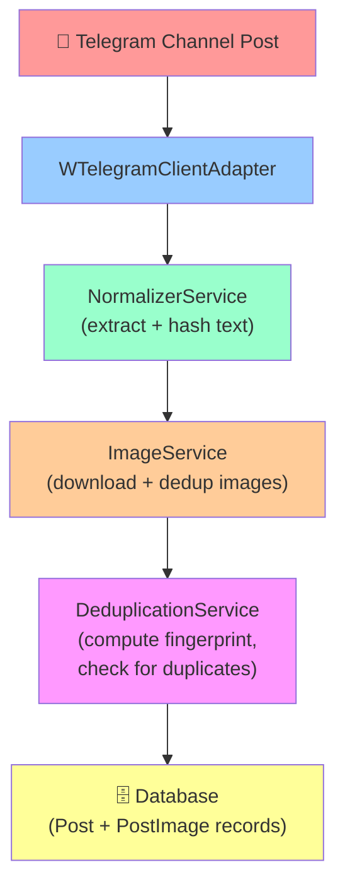
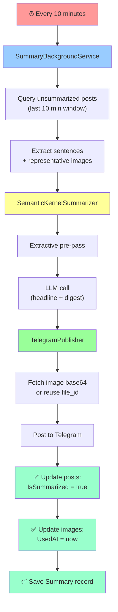
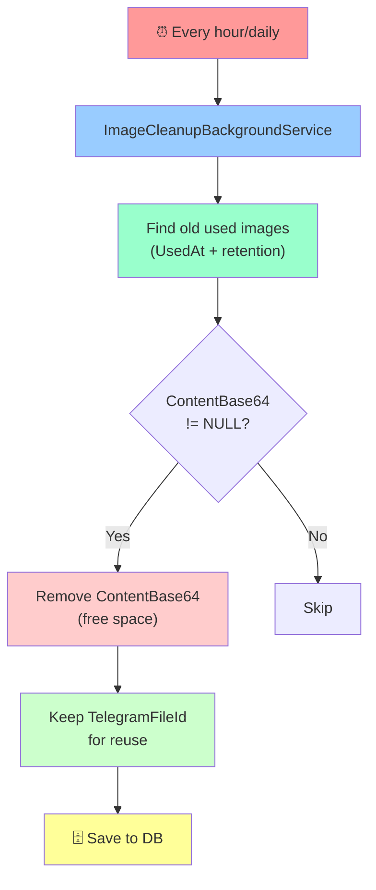
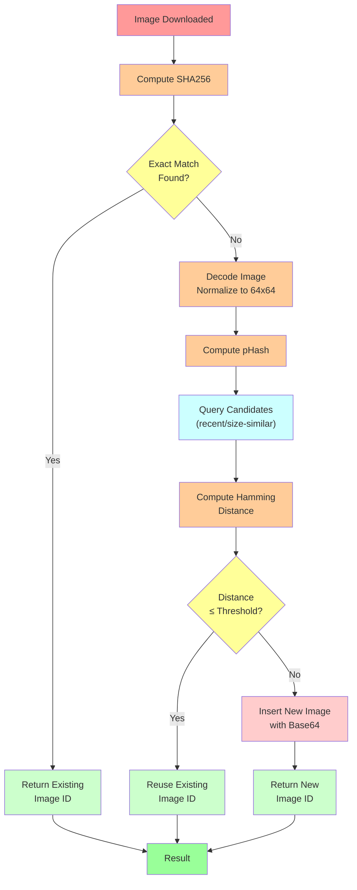
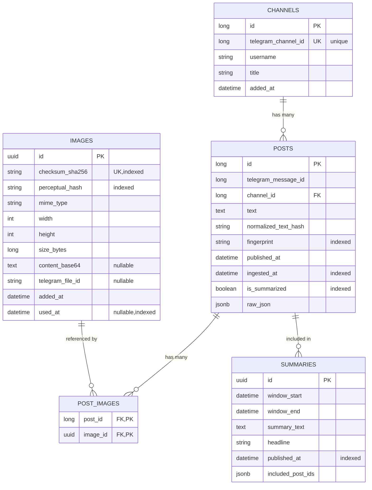

# Telegram News Aggregator - Architecture

## Overview

The Telegram News Aggregator is a distributed system built with .NET 10 and Dotnet Aspire that:
- Ingests news posts from multiple Telegram channels using a user-client
- Deduplicates content by text and image fingerprints
- Generates AI-powered summaries using Semantic Kernel every 10 minutes
- Posts summaries to a dedicated Telegram channel
- Manages image lifecycle with automatic cleanup

## High-Level Architecture Diagram

## Component Descriptions

### 1. **WTelegramClientAdapter** (Ingest)
- **Responsibility**: Connect to Telegram as a user and receive channel posts
- **Dependencies**: `WTelegramClient` library, DB context
- **Outputs**: Raw `Post` entities to database
- **Triggers**: Asynchronous stream of Telegram updates
- **Error Handling**: Retry logic for network failures, TOS compliance monitoring

### 2. **NormalizerService** (Text Processing)
- **Responsibility**: Extract and normalize text from posts
- **Process**:
  - Remove Telegram markup (bold, italic, links, etc.)
  - Normalize URLs to domain-only form
  - Remove excess whitespace
  - Compute SHA256 hash of normalized text
- **Output**: `NormalizedText` with original, normalized, and hash
- **Error Handling**: Handle invalid UTF-8 gracefully

### 3. **ImageService** (Image Processing & Dedup)
- **Responsibility**: Download images and detect duplicates
- **Process**:
  1. Download image bytes from URL
  2. Compute SHA256 checksum
  3. Query DB for exact match (checksum lookup)
  4. If no exact match:
     - Decode image using ImageSharp
     - Compute perceptual hash (pHash)
     - Query candidates (recent/size-similar images)
     - Compute Hamming distance for each candidate
     - If distance ≤ threshold: reuse existing image
     - Otherwise: insert new image with base64 content
  5. Return `ImageId` (existing or new)
- **Storage**: Images stored as base64 in PostgreSQL
- **Output**: Image metadata + `TelegramFileId` (after upload)
- **Error Handling**: Handle corrupt images, network timeouts, size limits

### 4. **DeduplicationService** (Post Dedup)
- **Responsibility**: Detect duplicate posts across time/channels
- **Process**:
  - Combine normalized text hash + sorted image checksums
  - Compute SHA256 to get fingerprint
  - Query DB for existing fingerprint within 24-hour window
  - Drop or link duplicates based on policy
- **Output**: Boolean (is duplicate) + fingerprint
- **Config**: Time window (configurable, default 24 hours)

### 5. **SummaryBackgroundService** (Orchestrator)
- **Responsibility**: Run summarization job every 10 minutes
- **Lifecycle**: `BackgroundService` with `PeriodicTimer`
- **Process**:
  1. Query unsummarized posts from last 10-minute window
  2. Filter low-value items (too short, spam)
  3. Extract representative sentences/images
  4. Call `SemanticKernelSummarizer`
  5. Call `TelegramPublisher`
  6. Mark posts as summarized, images as used
  7. Save `Summary` record
  8. Emit metrics
- **Error Handling**: Wrap timer in try-catch to prevent stopping, log errors, emit failure metrics
- **Optional**: Leader election for multi-instance runs (Postgres advisory lock)

### 6. **SemanticKernelSummarizer** (AI)
- **Responsibility**: Generate concise summaries from extracted posts
- **Two-stage process**:
  1. **Extractive Pre-pass**:
     - Score sentences (position, length, links)
     - Pick top N sentences
     - Select representative images
     - Truncate to token limit
  2. **Abstractive Refinement** (via Semantic Kernel):
     - Call LLM with extracted text + prompt
     - Request: headline (≤10 words) + digest (≤150 words)
     - Handle rate limits, timeouts, invalid responses
- **LLM Providers**: Azure OpenAI, OpenAI (configured)
- **Prompts**: Stored and versioned in config (or DB for versioning)
- **Error Handling**: Fallback to extractive summary if LLM fails, log failures, emit latency metrics

### 7. **TelegramPublisher** (Output)
- **Responsibility**: Post summaries to the summary channel using bot
- **Process**:
  1. Format message: headline + digest + source channel credits
  2. For each image:
     - If `TelegramFileId` exists: reuse via file_id
     - Otherwise: encode base64 → `bytes`, upload via bot API, store returned file_id
  3. Post message with media to `SummaryChannelId`
  4. Return Telegram message ID
- **Requirements**: Bot must be added to summary channel (admin or at least poster)
- **Error Handling**: Retry on transient errors (network, rate limit), log failures

### 8. **ImageCleanupBackgroundService** (Maintenance)
- **Responsibility**: Remove base64 content from old, used images
- **Lifecycle**: `BackgroundService` with `PeriodicTimer` (hourly/configurable)
- **Process**:
  1. Find images with `UsedAt != null` and `UsedAt < (now - ImageRetentionHours)` and `ContentBase64 != NULL`
  2. Set `ContentBase64 = null` (free space, keep metadata + TelegramFileId for reuse)
  3. Optionally delete entire row if `TelegramFileId` is null
  4. Emit cleanup metrics (count, bytes freed)
- **Config**: Retention hours (default 168 = 7 days), cleanup interval
- **Error Handling**: Use bulk operations to avoid N+1 queries, log errors

### 9. **AppDbContext** (Data Access)
- **ORM**: Entity Framework Core with Npgsql
- **Tables**:
  - `channels` — metadata for each source channel
  - `posts` — ingested posts with text, hashes, state
  - `images` — image metadata, checksums, hashes, base64 content, file_ids
  - `post_images` — junction table linking posts to images
  - `summaries` — generated summaries with included post references
- **Indexes**:
  - `channels(telegram_channel_id)` — unique lookup by Telegram ID
  - `posts(channel_id, ingest_at, is_summarized)` — efficient window queries
  - `images(checksum_sha256)` — exact-match image dedup
  - `images(perceptual_hash)` — pHash candidate finding
- **JSON columns**: `posts.raw_json`, `summaries.included_post_ids` (jsonb for rich metadata)

## Data Flow

### Ingestion Flow

### Summarization Flow

### Cleanup Flow

### Service Interaction Diagram

```mermaid
graph LR
    subgraph Ingest["📥 Ingest Layer"]
        WTA["WTelegramClientAdapter"]
    end

    subgraph Process["⚙️ Processing Layer"]
        NRM["NormalizerService"]
        IMG["ImageService"]
        DED["DeduplicationService"]
    end

    subgraph Store["🗄️ Storage Layer"]
        DB["AppDbContext<br/>(Postgres)"]
    end

    subgraph Summarize["📝 Summarization Layer"]
        SUM["SummaryBackgroundService"]
        SK["SemanticKernelSummarizer"]
        PUB["TelegramPublisher"]
    end

    subgraph Maintain["🧹 Maintenance Layer"]
        CLEAN["ImageCleanupBackgroundService"]
    end

    subgraph External["🌐 External Services"]
        TG1["Telegram<br/>(User API)"]
        TG2["Telegram<br/>(Bot API)"]
        LLM["LLM Provider<br/>(OpenAI/Azure)"]
    end

    WTA -->|Posts| NRM
    NRM -->|Normalized| IMG
    IMG -->|Images| DED
    DED -->|Fingerprint| DB

    DB -->|Poll| SUM
    SUM -->|Extract| SK
    SK -->|Call| LLM
    LLM -->|Response| PUB
    PUB -->|Post| TG2

    DB -->|Poll| CLEAN
    CLEAN -->|Cleanup| DB

    TG1 -->|Updates| WTA

    style WTA fill:#99ccff
    style NRM fill:#99ffcc
    style IMG fill:#ffcc99
    style DED fill:#ff99ff
    style DB fill:#ffff99
    style SUM fill:#99ccff
    style SK fill:#ffff99
    style PUB fill:#99ff99
    style CLEAN fill:#99ffff
    style TG1 fill:#ff9999
    style TG2 fill:#ff9999
    style LLM fill:#ffff99
```

### Image Deduplication Algorithm

### Database Schema Diagram

---

## Resilience & Reliability

### Retry Policies (Polly)
- **Image downloads**: Exponential backoff (3 retries, 2s→8s)
- **Telegram.Bot calls**: Exponential backoff (3 retries)
- **LLM calls**: Exponential backoff (2 retries, longer delays), rate-limit (429) handling

### Circuit Breaker
- **Image downloads**: Fail after 3 consecutive failures, 30s reset
- **LLM calls**: Custom handling for rate limits

### Error Handling
- Ingest failures don't stop the service; logged and skipped
- Summarization failures logged and retry on next cycle
- Publishing failures trigger metric and alert

### Graceful Shutdown
- PeriodicTimers properly disposed
- Background services await completion
- DB connections closed

## Scalability Considerations

### Current (Single Instance)
- Suitable for up to 100 source channels, 1000+ posts/hour
- Postgres can handle storage + queries locally
- SQLite alternative for very small deployments

### Multi-Instance (Future)
- Use Postgres advisory locks for leader election (only one instance runs summarizer)
- Health checks expose instance health
- Service discovery for load balancing (via Aspire)

### Large Scale (Future)
- Move image storage to S3; keep only references + metadata in DB
- Use pgvector + CLIP for better image similarity (replaces pHash)
- Partition `posts` table by channel or time range
- Separate read/write replicas for DB
- Kafka/message queue for async ingestion
- Distributed caching (Redis) for dedup lookups

## Observability

### Logging
- Structured logging via `Microsoft.Extensions.Logging`
- Centralized export (Seq, ELK, Azure Monitor) — configured later
- Correlation IDs for tracing full request lifecycle
- Log levels: DEBUG (low-level detail), INFO (milestones), ERROR (failures)

### Metrics
- **OpenTelemetry** with Prometheus exporter
- **Counters**:
  - `telegramaggregator_ingestion_posts_total` — cumulative posts ingested
  - `telegramaggregator_summary_executions_total` — summary cycles run
  - `telegramaggregator_image_dedup_exact_hits_total` — exact-match dedup hits
  - `telegramaggregator_image_dedup_phash_hits_total` — perceptual-match hits
  - `telegramaggregator_publish_failures_total` — failed publishes
  - `telegramaggregator_image_cleanup_removed_total` — images cleaned up
- **Histograms**:
  - `telegramaggregator_summary_duration_seconds` — cycle latency
  - `telegramaggregator_summarizer_latency_seconds` — LLM latency
- **Gauges**:
  - `telegramaggregator_image_cleanup_bytes_freed` — bytes removed per cleanup
  - `telegramaggregator_posts_unsummarized` — pending summaries
- **Grafana dashboards** created from these metrics

### Health Checks
- `/health` endpoint (Aspire default)
- `/alive` endpoint for liveness probes
- Custom checks: DB connectivity, Telegram user-client status (future)

## Configuration

### Environment Variables / appsettings.json
- `Worker:SummaryIntervalMinutes` (default 10)
- `Worker:ImageRetentionHours` (default 168)
- `Worker:PHashHammingThreshold` (default 8)
- `ConnectionStrings:postgres` — Postgres connection string
- `Telegram:BotToken` — bot token for publishing
- `Telegram:ApiId`, `ApiHash`, `UserPhoneNumber` — user-client credentials
- `SemanticKernel:Provider` — "AzureOpenAI" or "OpenAI"
- `SemanticKernel:AzureOpenAI:Endpoint`, `ApiKey`, `DeploymentName`
- `SemanticKernel:OpenAI:ApiKey`, `ModelId`

### Secrets Management
- Store sensitive values in environment variables or Aspire secrets
- Never commit `.env` files or credentials to source control
- Use Azure KeyVault (production) or Doppler (development)

## Technology Stack

| Component | Technology | Version | Purpose |
|-----------|-----------|---------|---------|
| Runtime | .NET | 10.0 | Language/runtime |
| Host | Dotnet Aspire | latest | Service orchestration |
| ORM | EF Core + Npgsql | 8.0/8.0 | Postgres data access |
| Telegram (ingest) | WTelegramClient | latest | User-client API |
| Telegram (publish) | Telegram.Bot | 22.9+ | Bot API |
| Images | SixLabors.ImageSharp | 3.1+ | Image processing |
| pHash | Custom | — | Perceptual hashing (ImageSharp-based) |
| AI | Semantic Kernel | 1.72+ | LLM integration |
| LLM Providers | Azure OpenAI, OpenAI | APIs | Language models |
| Metrics | OpenTelemetry + Prometheus | 1.3+ | Observability |
| Logging | Microsoft.Extensions.Logging | built-in | Structured logging |
| Resilience | Polly | future phase | Retries + circuit breaker |
| Testing | xUnit, Testcontainers | future phase | Unit + integration tests |

## Security & Compliance

- **Secrets**: Keep API keys, connection strings, credentials out of source
- **Telegram TOS**: User-client account compliance monitoring
- **GDPR/Privacy**: Sanitize PII before sending to LLM, respect data retention
- **Rate Limits**: Respect Telegram and LLM provider limits; exponential backoff
- **Input Validation**: Sanitize text before DB/LLM calls
- **SQL Injection**: Use EF Core parameterized queries

## Future Enhancements

1. **Advanced Image Similarity**: CLIP embeddings + pgvector ANN search
2. **Safety Filters**: Content moderation, spam detection
3. **Multi-Language Support**: Translate summaries via LLM
4. **Admin UI**: Web interface for channel management, summary browsing
5. **Distributed Locking**: Multi-instance scheduler
6. **S3 Storage**: Move images to object storage
7. **Message Queue**: Kafka/RabbitMQ for async ingestion
8. **Database Sharding**: Partition by channel for large scale
9. **Custom Embeddings**: Fine-tuned summarization models
10. **Webhook Integration**: Notify external systems of summaries

## Deployment

### Local Development
- Docker Compose with Postgres + application
- Dotnet Aspire for local orchestration

### Production
- Container registry (Docker Hub, Azure CR, etc.)
- Kubernetes (EKS, AKS) or container orchestration platform
- Managed Postgres (RDS, Azure Database)
- CI/CD pipeline (GitHub Actions, Azure DevOps)

## References

- [EF Core Postgres](https://www.npgsql.org/efcore/)
- [Semantic Kernel](https://github.com/microsoft/semantic-kernel)
- [Telegram.Bot](https://github.com/TelegramBots/Telegram.Bot)
- [OpenTelemetry .NET](https://opentelemetry.io/docs/instrumentation/net/)
- [Dotnet Aspire](https://learn.microsoft.com/en-us/dotnet/aspire/get-started/aspire-overview)
